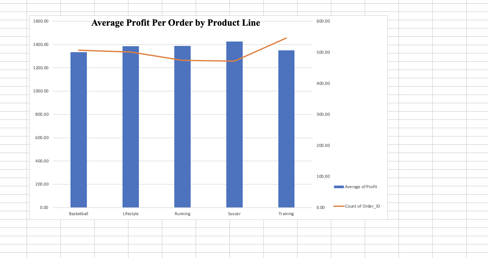
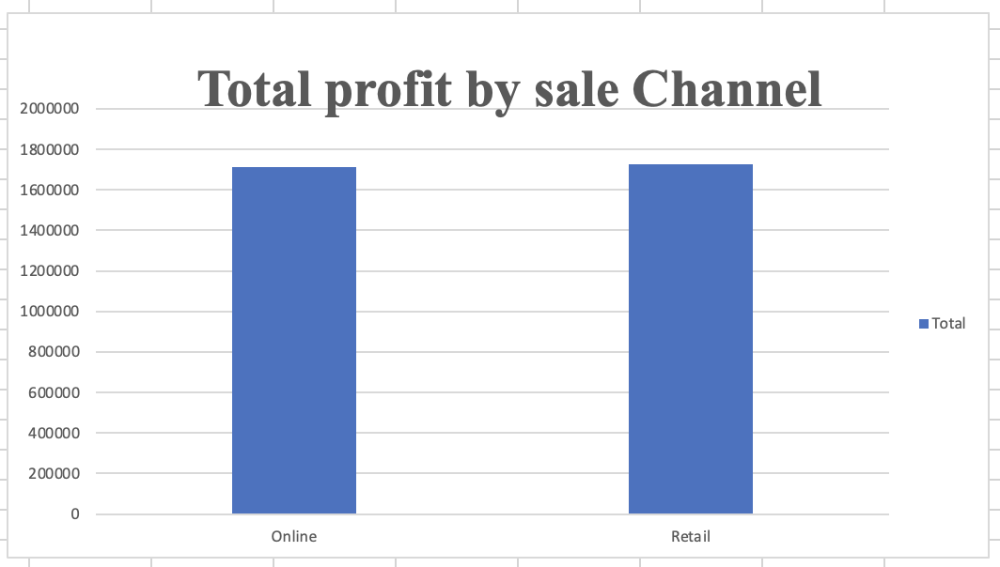

# Nike Sales Data Cleaning & Analysis

## Business Question
Which regions, product lines, sales channels, and gender categories generate the most profit, and how reliable is the data behind those answers?

## Dataset
- **Source:** [Add your Kaggle link here]
- **Size:** 2,500 orders, 13 columns
- **Columns:** Order_ID, Gender_Category, Product_Line, Product_Name, Size, Units_Sold, MRP, Discount_Applied, Revenue, Order_Date, Sales_Channel, Region, Profit
- **Period:** orders from late 2023 to late 2025
- **Note:** the currency is not stated in the file, so amounts are shown without a currency symbol.

## Tools Used
Microsoft Excel: Find & Replace, formulas (IF, COUNTIF, COUNTBLANK), Remove Duplicates, PivotTables, and charts.

## Data Cleaning: Problems and Fixes

| Problem | Rows affected | How I fixed it |
|---|---|---|
| Inconsistent region spellings (Hyd, hyderbad, hyderabad, bengaluru) | Multiple | Standardized to 6 cities (Bangalore, Delhi, Hyderabad, Kolkata, Mumbai, Pune) using Find & Replace |
| Mixed date formats (real dates and day-month-year text) | Multiple | Converted everything to yyyy-mm-dd with a formula, then pasted as values |
| Missing Order_Date | 1,884 (75.4%) | Left blank (not guessed), flagged, excluded from time-based analysis |
| Units_Sold of 0 or negative | 1,235 | Flagged as "Bad units", excluded from revenue calculation |
| Missing Units_Sold | 429 | Flagged as "Missing units", excluded from revenue calculation |
| Discount over 100% | 180 | Flagged, excluded from revenue calculation |
| Missing Discount_Applied | 1,668 | Assumed 0% discount for the revenue calculation |
| Revenue column showed 0 for almost every row | Most rows | Rebuilt as Units x MRP x (1 - Discount) in a new column |
| Duplicate rows | 0 | None found |
| Order_ID typo (2018 appeared twice, one sat between 2011 and 2013) | 1 | Corrected to 2012 because it followed the sequence |
| Size column mixes clothing sizes (M, L, XL) and shoe sizes (6 to 12) | n/a | Left unchanged, noted here |

**Key decision:** only 390 of 2,500 rows (15.6%) had enough valid data to calculate revenue. I did not guess missing values. Profit was filled in for all 2,500 rows, so the main analysis uses Profit.

## Key Findings

### Profit by Region
Bangalore earned the most total profit (621,948.74) and Hyderabad the least (525,094.60). The gap is 96,854.14, so Hyderabad is about 15.6% below Bangalore. The remaining regions fall in between: Kolkata, Delhi, Mumbai, then Pune.

### Profit by Product Line
Training had the highest total profit (737,669.90) and Running the lowest (658,328.44).

### Average Profit per Order by Product Line
Soccer earns the most per order (1,426.50) despite having the fewest orders (472). Training leads on total profit mainly because it has the most orders (546); its average per order (1,351.04) is the second lowest. Basketball has the lowest average (1,334.59). The overall average is 1,376.01 per order.

### Profit by Sales Channel
Retail earned slightly more profit (1,726,844.77) than Online (1,713,187.35). The difference is 13,657.42, or about 0.8%, so the two channels perform almost equally.

### Profit by Product Line and Gender Category
Women's products earned the most total profit (1,185,968.26), followed by Kids (1,134,925.82) and Men (1,119,138.04). The strongest single combination is Kids in Training (257,637.56), and the weakest is Men in Running (196,994.00). Women lead in Basketball and Running, Men lead in Soccer, and Lifestyle is almost even across all three groups.

## Limitations
- Revenue could be calculated for only 390 of 2,500 rows, so this analysis is based on Profit.
- 1,884 of 2,500 orders (75.4%) have no Order_Date, so I did not build a monthly or seasonal trend analysis.
- I could not verify how Profit was calculated in the source file.
- Profit totals are close across regions and channels, so small differences should not be over-interpreted.
- The currency is not stated in the dataset.

## Suggested Next Steps
- Look into why Hyderabad trails the other regions.
- Test whether Soccer's higher profit per order justifies more promotion, since it has the fewest orders.
- Fix data capture at the source: units, discount, and MRP were missing or invalid in many rows.

## Contact
Ayerteye Bismark Amatey | [Add your LinkedIn link]
